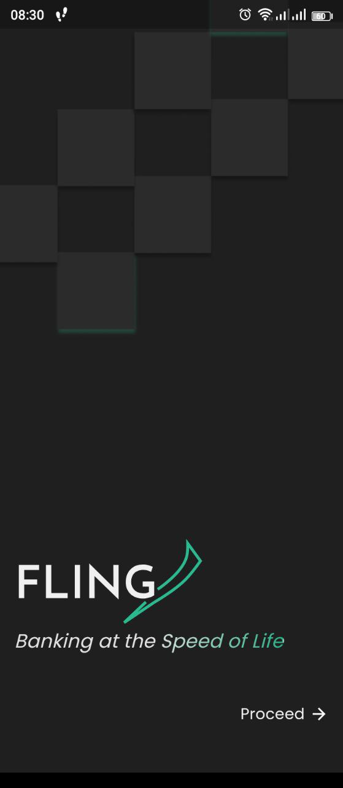
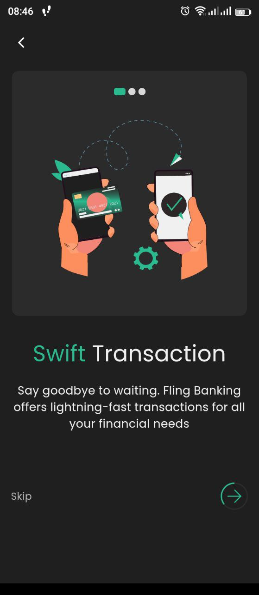
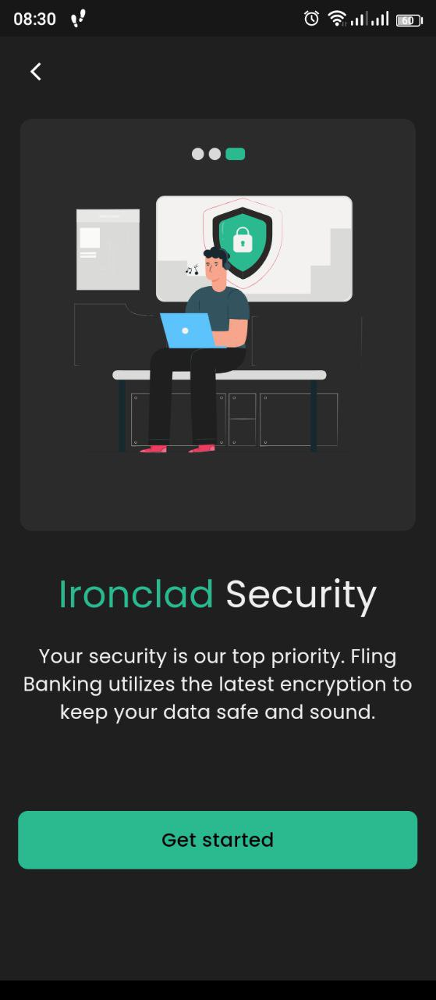
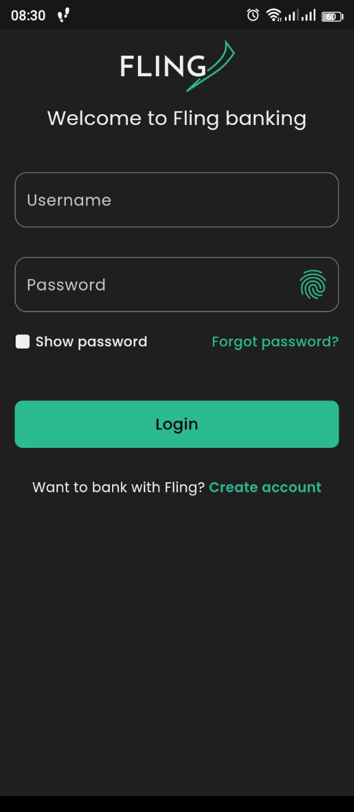
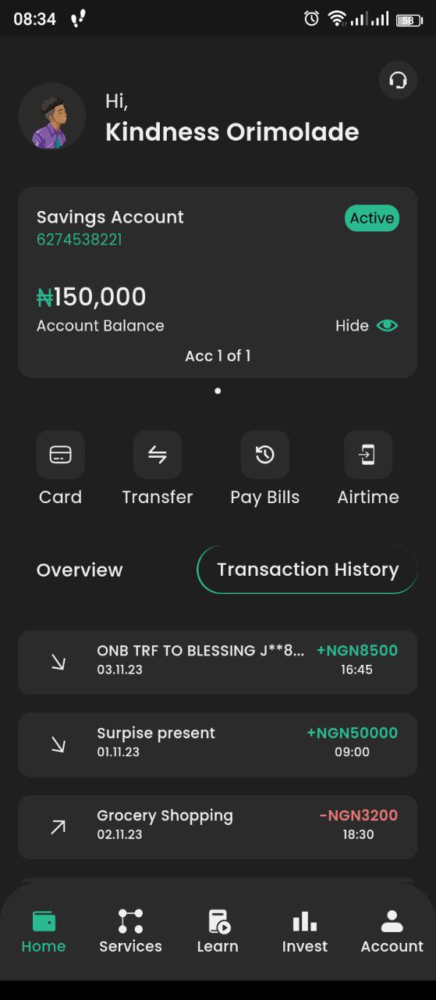
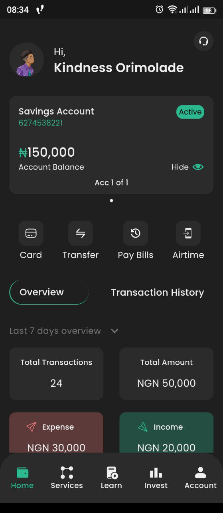
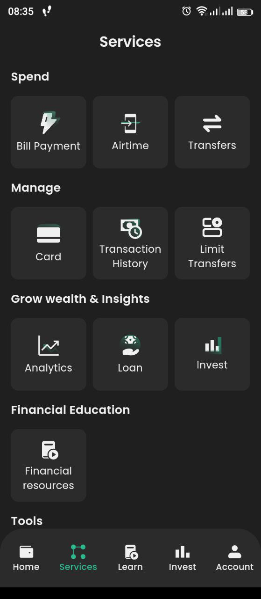
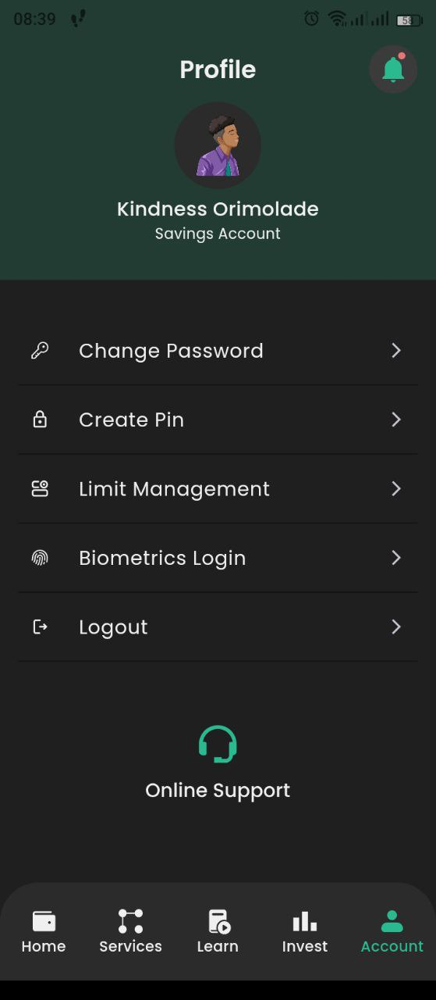

# Fling Banking App

An App that addresses the financial needs of bank users with improved financial management tools.

## Table of contents

- [Screenshot](#screenshots)
- [Built with](#built-with)
- [Acknowledgements](#acknowledgements)

### Screenshots

  

  

  

### Built with

- Flutter
- Dart
- Bloc for State Management
- GetX for Navigation

### Acknowledgements

- **Design**: The design for this app was created by [Kindness](https://kindness-portfolio.webflow.io/).

- **Development**: The app was developed by [Jeremiah](https://github.com/JER3MIAH).
